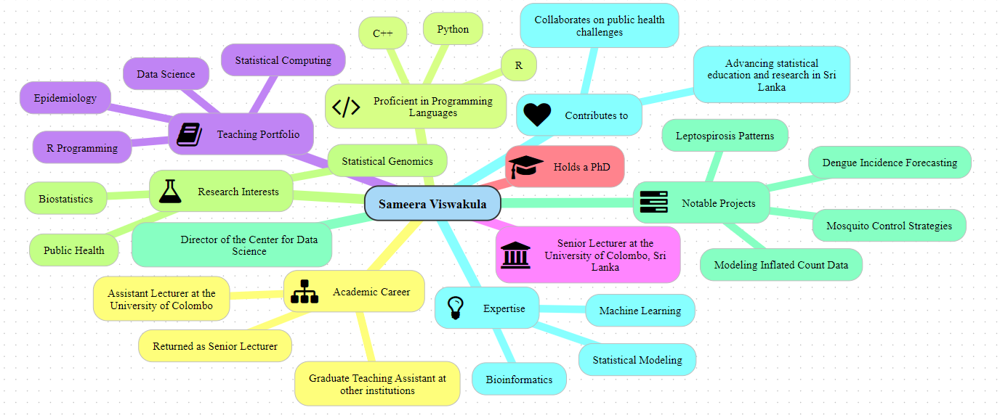

::: {#me}
## About me

I am a Senior Lecturer at the Department of Statistics, University of Colombo, Sri Lanka, where I work on computational statistics, genomic biostatistics, and machine learning. I enjoy building statistical models and R tools that turn messy data into useful, reproducible answers — and sharing that work through research, teaching, and consultancy.

## Interests

-   Computational Statistics
-   Genomic Biostatistics
-   Biological Data Modeling
-   Machine Learning
-   Big Data Analytics
-   R Programming

## Education

-   [x] PhD in Genomic Biostatistics, Old Dominion University, VA, USA
-   [x] MS in Statistics, University of Texas at El Paso, TX, USA
-   [x] BSc in Statistics (First Class Honours), University of Colombo, Sri Lanka
:::

## Experience

I have more than 15 years of experience in research, consultancy and teaching. I like to model data and communicate to public in efficient ways.

## Teaching

-   Computational Statistics Using R
-   Data Science
-   Big Data Analytics
-   Statistical Methods in Bioinformatics
-   Applied Non-parametric Statistical Methods

## Honors and Awards

1.  President’s Award for Scientific Research - 2018 (Awarded in April, 2021).
2.  National Research Council Merit Award for Scientific Research - 2020 (Awarded in May, 2025).
3.  University of Colombo Senate Award for Research Excellence - Certificate of Commendation - For years 2020, 2021, and 2025.
4.  Faculty Award for Research Excellence, Faculty of Science, University of Colombo - For years 2020, 2021, 2023, and 2024.
5.  Faculty Award for Academic Outreach and Institution Development, Faculty of Science, University of Colombo - For years 2019 to 2024.
6.  Graduate Statistician - Royal Statistical Society, 2014.
7.  Department of Statistics Gold Medal for the Final Year Statistics Project, 2008 University of Colombo, Sri Lanka.

## Grants Received

1.  Science and Technology Human Resource Development Project, Ministry of Education funded by Asian Development Bank (Inter-university collaboration with Faculty of Technology, University of Kelaniya) - 2023-2024
2.  NSF Research Grants for Health Sciences (Co-investigator) - 2016-2022
3.  University of Colombo Small Research Grant (Investigator) - 2017

## Research Publications

1.  Gunawardena H, Nissanka M, Satharasinghe DM, Viswakula S, Varatharajan M, Abeyweera A, Ganewatte E, Pathmathas T, Jayakody M, Padovani R, Jeyasugiththan J. [Evaluation of radiation doses and the impact of operator variability on radiation exposure in fluoroscopy-guided procedures: insights from Sri Lanka](https://doi.org/10.1088/1361-6498/adfdf1). *Journal of Radiological Protection*, 45(3), 2025.

2.  Sudasinghe, P., Viswakula, S., & Lakraj, P. [Can social media opinions add value to historical data? A study for T20I cricket match outcome prediction using machine learning](https://doi.org/10.1177/22150218251342185). *Journal of Sports Analytics*, 11, 2025.

3.  Wanniarachchi, D.V., Viswakula, S. & Wickramasuriya, A.M. [The evaluation of transcription factor binding site prediction tools in human and Arabidopsis genomes](https://doi.org/10.1186/s12859-024-05995-0). *BMC Bioinformatics*, 25, 371, 2024.

4.  Gunawardana, J., Viswakula, S., Rannan-Eliya, R. P., & Wijemunige, N. [Machine learning approaches for asthma disease prediction among adults in Sri Lanka](https://doi.org/10.1177/14604582241283968). *Health Informatics Journal*, 30(3), 2024.

5.  Pahala Ralalage BMSK, Kaluarachchi N, Randunu M, Jainulabdeen M, Nanthakumar R, Viswakula S, Galhena BP. [Validation of Fluorescence in Situ Hybridization (FISH) Assay Using an Analyte-Specific Reagent in Detecting Aneuploidies of Chromosomes 13, 18, 21, X, and Y in Prenatal Diagnosis](https://doi.org/10.21926/obm.genet.2301177). *OBM Genetics*, 7(1), 177, 2023.

6.  Cabraal MNS, Samarawickrama RIU, Kodithuwakku KARR, Viswakula SD, Lantra SR. Nationwide descriptive study of COVID-19 in children below the age of 14 years in Sri Lanka. *Sri Lanka Journal of Child Health*, 50(1), 2021.

7.  Withanage, G.P., Gunawardana, M., Viswakula, S.D., Samaraweera, K., Gunawardena, N.S. & Hapugoda, M.D. [Multivariate spatio-temporal approach to identify vulnerable localities in dengue risk areas using Geographic Information System (GIS)](https://doi.org/10.1038/s41598-021-83204-1). *Scientific Reports*, 11, 4080, 2021.

8.  Withanage, G.P., Viswakula, S.D., Gunawardene, Y.S. & Hapugoda, M.D. Use of Novaluron-Based Autocidal Gravid Ovitraps to Control Aedes Dengue Vector Mosquitoes in the District of Gampaha, Sri Lanka. *BioMed Research International*, 2020.

9.  Manoharan, V., Karunanayake, E.H., Tennekoon, K.H., De Silva, S., Imthikab, A.I.A., De Silva, K., Angunawela, P., Viswakula, S. & Lunec, J. Pattern of nucleotide variants of TP53 and their correlation with the expression of p53 and its downstream proteins in a Sri Lankan cohort of breast and colorectal cancer patients. *BMC Cancer*, 20, 72, 2020.

10. Withanage, G.P., Hapuarachchi, H.C., Viswakula, S., Gunawardena, Y.I.N.S. & Hapugoda, M. Entomological surveillance with viral tracking demonstrates a migrated viral strain caused dengue epidemic in July, 2017 in Sri Lanka. *PLoS ONE*, 15(5), 2020.

11. Wijesinghe, I.H. & Viswakula, S.D. Machine Learning for Pre-Auction Sample Selection. *National Information Technology Conference (NITC)*, Colombo, 2018.

12. Withanage, G.P., Viswakula, S.D., Gunawardena, Y.I.N.S. & Hapugoda, M.D. A forecasting model for dengue incidence in the District of Gampaha, Sri Lanka. *Parasites & Vectors*, 2018.

13. Bruhn, A., Newcomb, T. & Viswakula, S. Feedback Delay as an Approach to Teaching Oral Radiographic Technique. *Radiology Science and Education*, AEIRS, 2017.

14. Denipitiya, T.H., Chandrasekharan, V., Abeyewickreme, W., Viswakula, S. & Hapugoda, M. Spatial and seasonal analysis of human leptospirosis in the District of Gampaha, Sri Lanka. *Sri Lankan Journal of Infectious Diseases*, 2016.

15. Diggs, L.A., Viswakula, S.D., Sheth-Chanda, M. & Leo, G.D. A Pilot Model for Predicting the Success of Prehospital Endotracheal Intubation. *The American Journal of Emergency Medicine*, 33(2), 202-208, 2015.

16. Yehdego, D.T., Kodimala, V.K., Viswakula, S., Zhang, B., Vegesna, R., Johnson, K.L., Taufer, M. & Leung, M.-Y. Secondary structure predictions for long RNA sequences based on inversion excursions: preliminary results. *Proceedings of the ACM Conference on Bioinformatics, Computational Biology and Biomedicine*, 545-547, 2012.

17. Viswakula, S. & Sooriyaarachchi, M.R. Diagnostics for matched case control studies: SAS macro for Proc Logistic. *Journal of the National Science Foundation of Sri Lanka*, 39, 13-23, 2011.

For the complete and continuously updated list, visit [Google Scholar](https://scholar.google.com/citations?user=fzAQV6wAAAAJ&hl=en).

{width="1196"}
